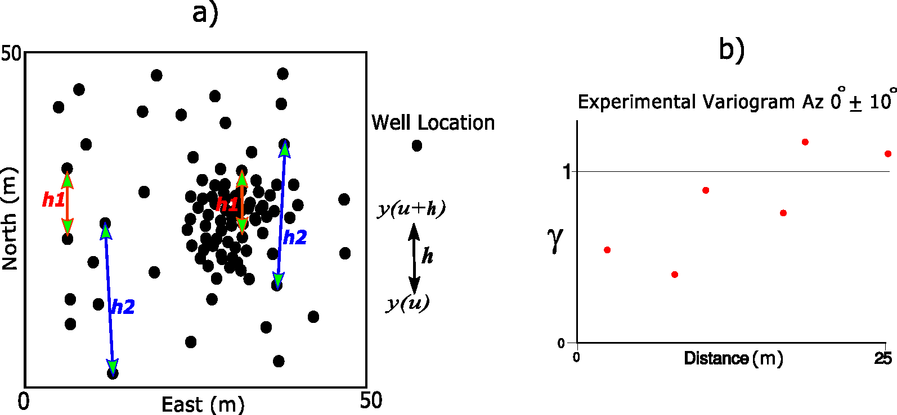

# Delustering to Improve Preferential Sampling

This work has been published by **Mehdi Rezvandehy** and **Clayton V. Deutsch** at Journal of [Stochastic Environmental Research and Risk Assessment](https://doi.org/10.1007/s00477-017-1388-x) https://doi.org/10.1007/s00477-017-1388-x. Here is a **Python** implementation with realistic data for declustering spatial correlation of data. If you have any question about the approach and implementation, please email me at [Mehdi Rezvandehy](rezvande@ualberta.ca).

# Abstract

**The spatial correlation called variogram is a key parameter for geostatistical estimation and simulation. Preferential sampling may bias the spatial structure and often leads to noisy and unreliable variograms. A novel technique is proposed to weight variogram pairs in order to compensate for preferential or clustered sampling. Weighting the variogram pairs by global kriging of the quadratic differences between the tail and head values gives each pair the appropriate weight, removes noise and minimizes artifacts in the experimental variogram. Moreover, variogram uncertainty could be computed by this technique. The required covariance between the pairs going into variogram calculation, is a fourth order covariance that must be calculated by second order moments.**

# Introduction

Geostatistical modeling is widely used to estimate and simulate properties in the petroleum and mining industries. One of the key parameters for geostatistical modeling of continuous variables is the variogram or covariance function for each property. Variogram modeling is performed to fit a model to a sample variogram computed from the data: experimental variogram points are not directly used in geostatistical modeling since the variogram function is required for all distances and they must be positive definite. The variogram model (fitted model) can be attained manually or by applying an algorithm (used in autofiting software) to achieve the optimum fitted variogram model. One conventional approach of auto variogram modeling is measuring the goodness of fit by an objective function, which is the sum of the squared difference between the experimental variogram and the modeled variogram. Random changes to the variogram model that decrease the objective function are accepted. This process is repeated many times (say more than 10000) to obtain the best fitted variogram model with the minimum objective function. Variogram modeling is not the aim of this study.

In practice, variogram modeling is suboptimal in presence of irregular and preferential positioning of the wells. Based on geological and geophysical information data, the data are likely located in the areas of higher quality that would be developed first or that would maximize production. Higher valued areas are also more variable, thus, equal-weighted experimental variograms are often noisy and biased. Weighting the data by declustering techniques compensates for the geometric configuration of the data locations and corrects the statistics; however, this approach is not normally considered in variogram calculation where equal weights are often considered for the variogram pairs. The experimental variogram for a particular lag vector is computed as:
\begin{equation}
\hat{\gamma_{1}}(\textbf{h})=\frac{1}{2n(\textbf{h})} \sum_{i=1}^{n(\textbf{h})} \left [y(\textbf{u}_{i})-y(\textbf{u}_{i}+\textbf{h}) \right ]^{2}, \,\,\,\,\,\,\,\, i=1,...,n(\textbf{h})
\end{equation}
 where $n(\textbf{h})$ is number of variogram pairs for each lag distance $\textbf{h}$. Each lag of the experimental variogram $\hat{\gamma_{1}}(\textbf{h})$ is a variable comprised of pairs of well data $y(\textbf{u}_{i})$, $y(\textbf{u}_{i}+\textbf{h})$. **Figure 1**-a shows a synthetic example of clustered well locations in areas of high quality, and sketch of its corresponding variogram for azimuth $0^{\circ} \pm 10^{\circ} $ (b). The variogram is unstable and has fluctuations because for the short lag distance (lag distance $h_1$ in a) the majority of pairs are located in the high quality area with greater variability, and for a larger distance (lag distance $h_2$ in a) the majority of pairs are located in low quality areas. This unbalanced number of pairs within low and high quality areas leads to a noisy variogram due to the fact that the equal weighted averaging as in Equation above does not account for preferential sampling.

**Figure1**: *a) Synthetic example of clustered locations in areas of high quality (the center right of the sketch). b) Sketch of experimental variogram for azimuth $0^{\circ} \pm 10^{\circ} $. The noisy and unreliable variogram is due to clustering some variogram pairs in high valued areas.*
 
